# 写在前面
+ 这是我的`本科毕业设计`,基于江南一点雨的微人事项目进行了业务扩展,这里仅展示之前项目没有的或我新做的业务功能，已有的或者没有改动的不做说明， 大家可以看江南一点雨的那个。[江南一点雨 - 微人事](https://github.com/lenve/vhr) 
+ 不是专业前端，所以只有1920*1080 分辨率可以正常显示，整体做的很烂...，前端代码在库里，[毕业设计前端代码(基于VUe+Element的人事管理系统)](https://github.com/LIRUILONGS/HROS-UI)，
+ 陆续有小伙伴找我要毕业论文参考，所以抽时间整理下：
+ 论文+ PPT+ 答辩稿 + 项目部署包+ 数据库sql(需要建库vhr) 在论文文件夹
+ 如果想部署的小伙伴可以直接部署，只需要jdk，mysql环境就可以
+ CSDN :[https://liruilong.blog.csdn.net/](https://liruilong.blog.csdn.net/)
+ 个人博客：[https://liruilongs.github.io/](https://liruilongs.github.io/)

```bash
nohup java -jar hros-1.2.1-SNAPSHOT.jar &
tail -f nohup.out
```
+ 环境只用到了jdk和mysql ，发送邮件那块我用脚本写的，后来已经注释掉了，如果需要发送邮件，还需要python环境，调整代码。
### [项目演示地址](http://39.97.241.18:8082/index.html) 嗯，服务器快到期了，后期可能看不了啦
### 最后，`对小伙伴有帮助的话给个star ^_^ 生活加油！。`

# 基于SpringBoot的人事管理系统，


## 项目概述
人事管理系统功能包括人事通讯,员工信息,人事考评,奖惩,培训管理,薪资管理,统计分析,和系统管理六大模块,对应人事工作基本流程:新员工入职档案建立,调动,辞职,员工信息的查询及工资管理等方面.系统管理可以根据不同的角色分配菜单权限设置,不同的用户授予不同角色,对人事结构,单位结构进行整体调配设置.在线聊天可以实现操作员之间讯息的及时通讯.
项目基于MVVM的前后端分离开发模式进行开发.MVVM即模型(Model)-视图(View)-视图模型(View Model),实现了数据视图的双向绑定.相对于MVC模式和MVP来说,MVVM是一个比较新的开发架构,它是一种将MVP模式与WPF相结合应用方式发展演变而成的新型开发架[1] .
前后端分离是指将前端和后端从之前的全部由后端负责中分离开来,不再共用一个Server,前端作为一个独立Serve存在[2].前后端通过接口使用HTTP协议交互,本项目使用vu实体属性outer做前端路由处理.页面跳转不在由后端处理,前后端只是数据的交互.前后端分离的好处在于降低了前后端的耦合性.当面对不同的硬件场景时,需要构建不同的界面,前后端分离之后,只需要扩展前端项目即可,不需要修改后端服务.
在动态权限处理方面,使用安全框架Spring Security,基于RBAC（Role-Based Access Control ）角色的访问控制模型,由该模型主要由鉴权和授权构成,鉴权基于Servlet中Filter原理处理,授权由系统管理员操作.RBAC 的主要思想是：权限是和角色相关的,而用户则被分配相应的角色作为其成员,这样就大大简化了权限的管理 [3] .
## 技术栈：
本系统中技术使用,后端技术涉及到Spring Boot,Spring Security, MyBatis, MySQL等,前端技术设计到Vue, ElementUI, axios,Web Socket等.系统架构基于B/S架构.
+ `Spring Boot`是当前流行的Java EE体系框架,Spring Boot提供了一种新的编程范式,能在小的阻力下开发Spring应用程序,可以更加敏捷地开发Spring应用程序,专注于应用程序的功能,不用在Spring的配置上多花功夫,甚至完全不用配置[4].Spring Boot遵循约定大于配置的理念,在父子工程理念上极大程度上解决了依赖冲突的问题.
+ `Spring Security`是Spring家族中的安全框架,Spring Boot对于Spring Security提供了自动化配置方案,可以零配置使用 Spring Security .Spring Security借助过滤器技术对Web应用进行保护,包括认证和授权两个过程[5].
+ `Mybatis,MySQL`是持久化技术,都是开源轻量,Mybatis是ORM解决方案,MySQL是数据库系统.
+ `Vue` 是一套用于构建用户界面的渐进式框架.与其它大型框架不同的是,Vue 被设计为可以自底向上逐层应用,Vue 的核心库只关注视图层,不仅易于上手,还便于与第三方库或既有项目整合[6] .
+ `axios`是基于Promise 用于浏览器和 node.js 的 HTTP 客户端的异步编程解决方案,可以从浏览器中创建XMLHttpRequests,从node.js中创建http请求,支持Promise API,拦截请求和响应,转换请求数据和响应数据,客户端支持防御XSRF等[7] .
+ `vue-router`在项目中用于前端动态加载路由管理.SPA应用来讲,其实就是在前后端分离的基础上,加一层前端路由,即是由前端来维护路由规则,实现有两种,一种是利用url的hash,另一种就是HTML5的History模式[8] .这里我们使用vu实体属性outer的hash方式.
+ `B/S`架构是对C/S架构的一种改进,软件应用的业务逻辑完全由服务端实现,依托于浏览器,相对于C/S更轻量,用户体验要差一些,但是基于B/S的SPA和AJAX技术完美的解决了这个问题[9].

## 项目实现
用户登录访问后由Spring Security的WebSecurityConfigurerAdapter类实现认证和授权校验.登录成功后跳转主页,之后的每一次访问都会通过校验用户,角色,基于Ant格式的URL权限的匹配.

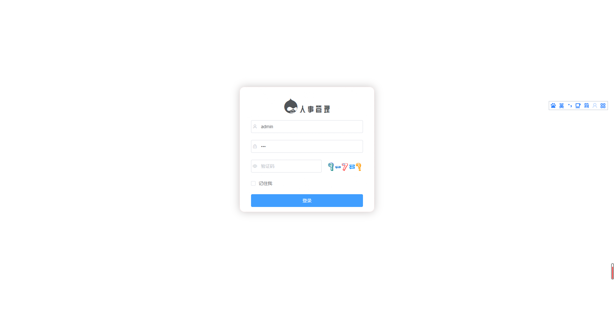
## 公共模块
### 主页
主页由日志和系统公告构成.逻辑处理上默认加载最新的操作日志及公告信息,数据展示通过Spring定时任务方式.服务端定时执行SQL.以排序和截取方式获取最新入库数据,动态更新数据.
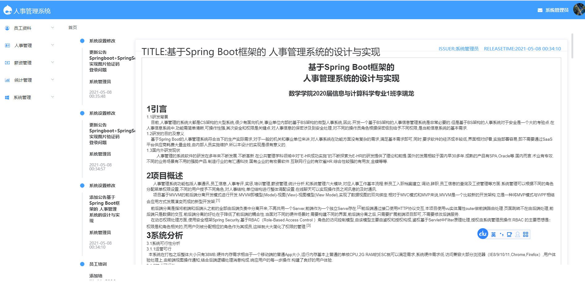
### 在线聊天
在线聊天实现点对点的在线通讯.前端基于全双工通信WebSocket实现, WebSocket由HTTP建立连接,由TCP进行会话,Web服务器与客户端之间建立起WebSocket协议的连接,之后的协议都依靠专用协议进行,通信过程中可以互发送JSON,XML,HTML或图片等任意格式的数据,由于是建立在HTTP基础的协议上,即发起方仍是客户端,一旦确立WebSocket通信连接,不论服务器还是客户端,任意一方都可以直接向对方发送报文[10] . 在处理逻辑上.由键值对构建消息对象.
后端基于Spring 框架提供的 WebSocket 的 STOMP 支持, STOMP 是一个简单的可互操作的协议, 通常被用于通过中间服务器在客户端之间进行异步消息传递. 
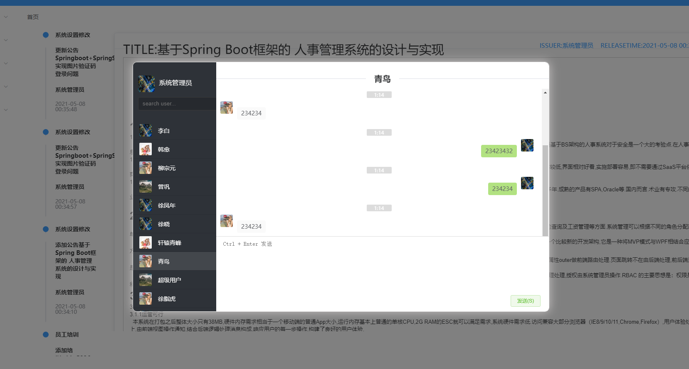 
## 员工资料
### 基本资料
实现对员工基本资料的增删改查.实现员工基本资料表Excel导入导出,多条件搜索.添加员工由数据库自动生成工号,其他信息为必填项.修改根据id进行数据更新.
    见之前项目。
### 高级资料
高级资料主要实现查询功能,由以下三部分信息构成:
1)培训资料:培训日期,培训内容.
2)考评资料:考评日期,考评内容,考评结果.
3)工资信息:账套名称,基本工资.
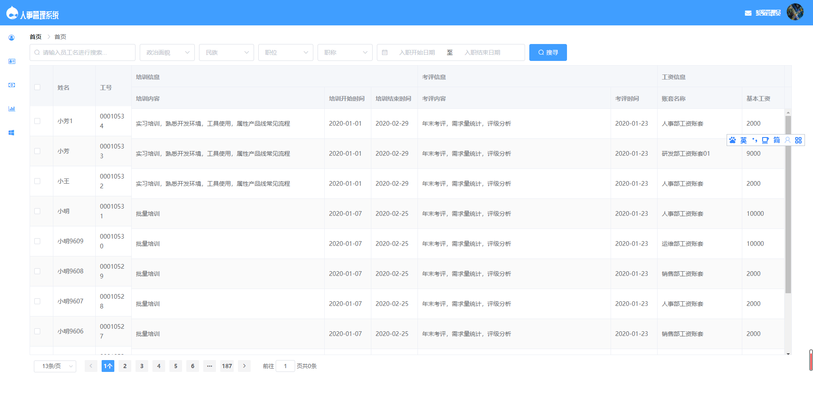 
## 人事管理
### 员工奖惩.
人事管理主要用于对员工奖惩,培训,考评,调动信息的管理.员工奖惩主要对员工奖惩模块的增删改查的实现.在UI设计上使用穿梭框和tab标签,逻辑处理上员工实体和奖惩信息是一对多的关系,即对同一员工在相同或者不同时间都可以添加多个奖惩,奖惩管理页面显示有奖惩信息的全部员工,可以查看奖惩详情.

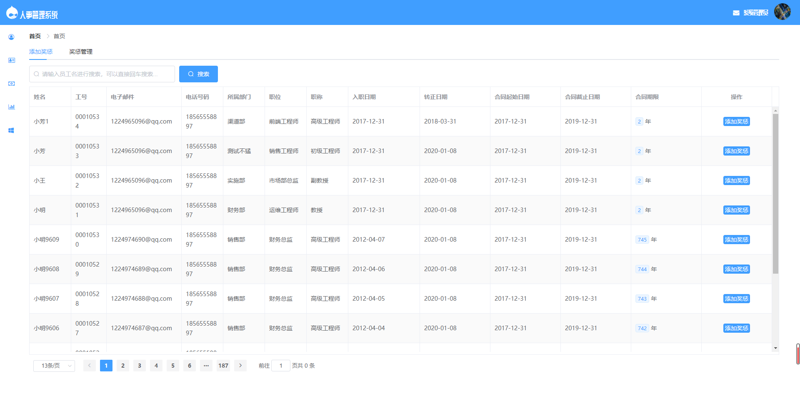 
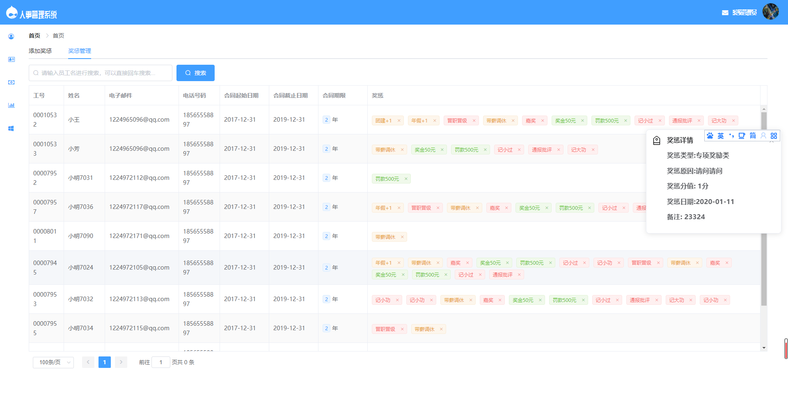 
### 员工培训
员工培训模块主要是对员工培训业务的增删改查的实现.员工培训由添加培训和培训管理两个子模块构成.在UI设计上加了进度条.逻辑处理上是一对一的关系,即同一员工在一个时间段只能参加一个培训,培训完成删除当前培训后可以添加新的培训,支持批量添加培训,培训进度修改.
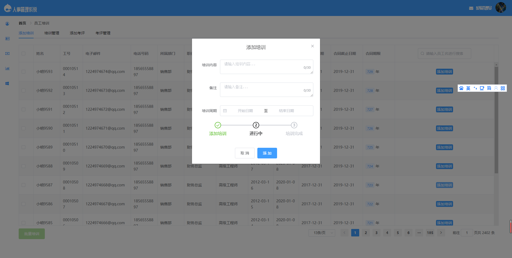
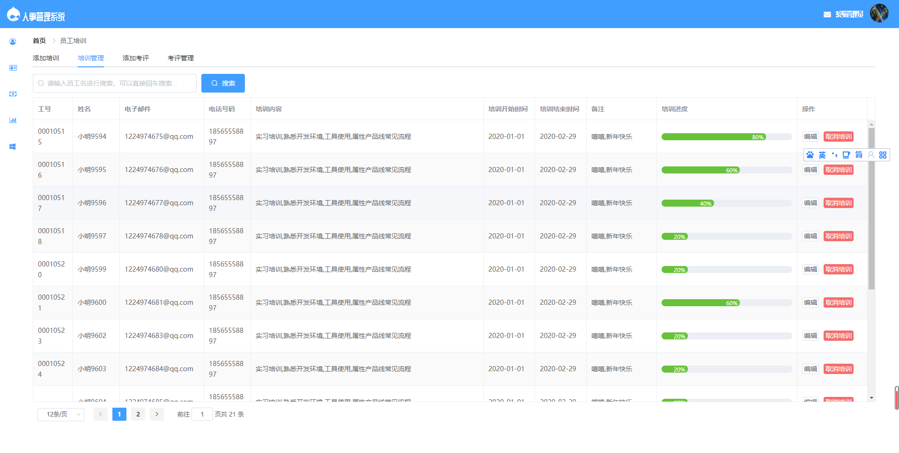  
### 员工好评
员工好评模块即对员工评价业务的增删改查的实现.UI设计上结合评分条步骤条,支持批量添加评价.逻辑处理上是一对一的关系.
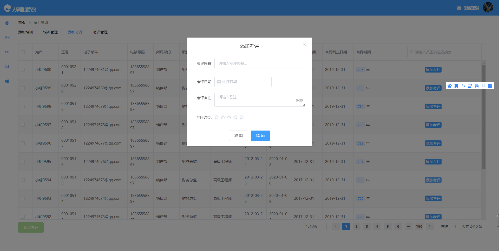 
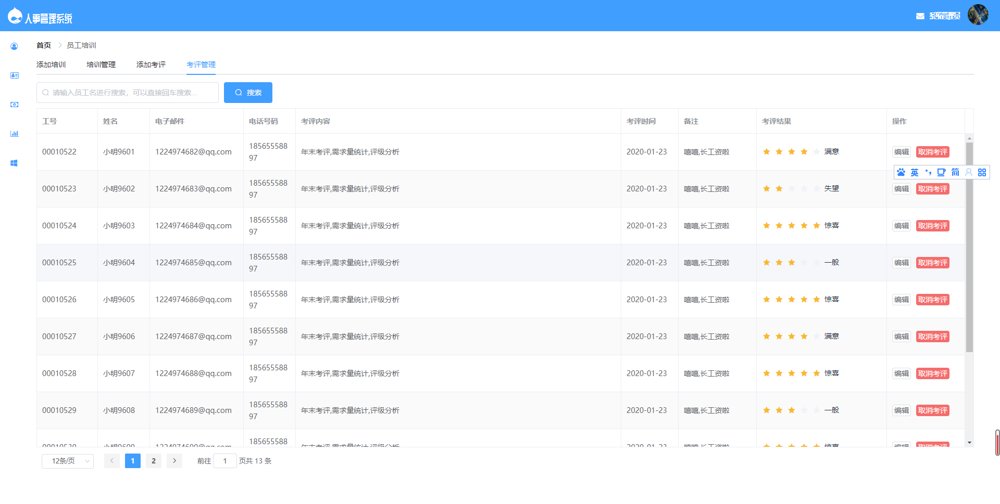 
### 员工调动
员工调动模块即对员工调用的增删改查的实现.UI设计上由table内嵌table构成,逻辑处理上是一对多的关系.
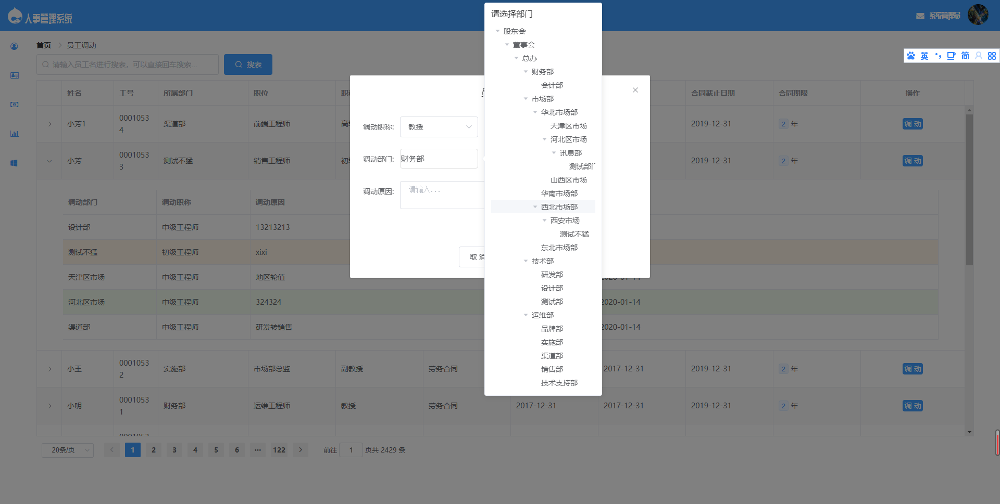 
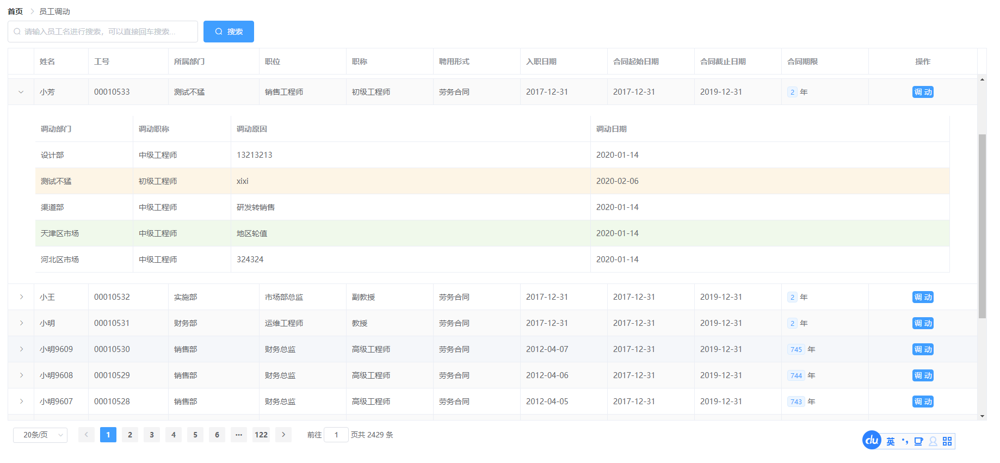 
## 工资管理
### 工资账套管理
实现对员工工资账套管理,员工账套设置,工资表管理,查询一系列对员工工资管理的功能.工资账套管理主要对员工奖金,基本工资,提成等各项的增刪改查. 设置当前套账信息.
### 员工账套设置
员工讨账设置主要根据公司账套查看相应的员工的工资信息,并实现员工套账的其增删功能.
### 工资表管理
工资表管理集中对员工工资,进行搜索查看的功能.添加筛选过滤功能,可以根据不同的职称部门进行表内筛选,工资套账详情查看.
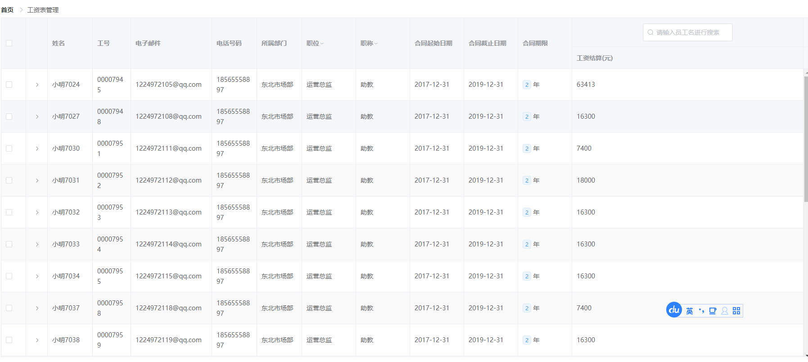 

## 统计管理
统计管理主要对员工资料的动态分析统计,包括员工积分统计,人事信息统计,人事记录统计.在设计方面结合图表处理VeCharts,由服务端对数据进行了整合,由VeCharts展示.代码方面,结合java8的Stream API及数据库端聚合函数实现.数据动态展示基于Spring定时任务.
### 员工积分统计
根据工号查找员工的积分情况.以条形图显示当前有积分员工的积分分布情况.积分分值由员工奖惩产生.
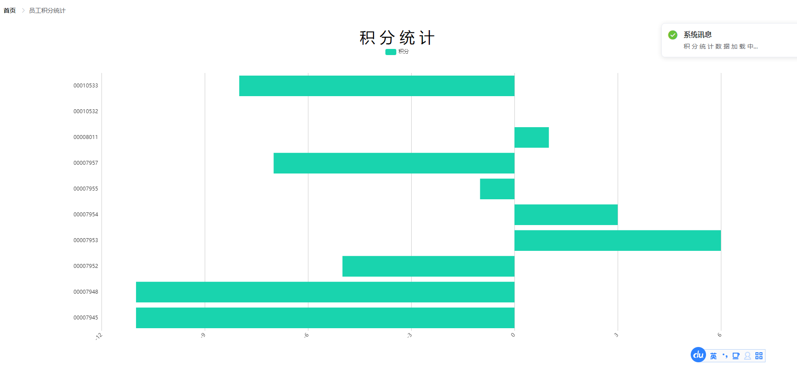 
### 人事信息统计
人事信息统计主要对员工人数信息进行的分析统计,饼图的方式展示.以高校.职称.职位.党派.民族.学历.部门为维度的人员分布图,用于人事统计.
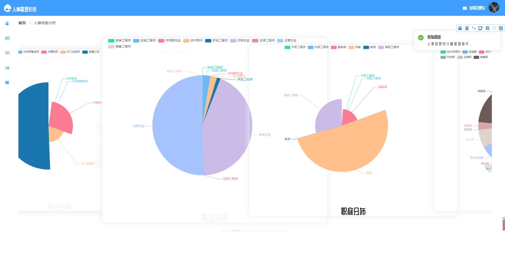 
### 人事记录统计
人事记录统计主要对员工离职信息的统计,以部门.职称.职位为维度,对员工离职率,离职工龄,离职年龄进行分析.以柱状图结合折线图的方式统计.
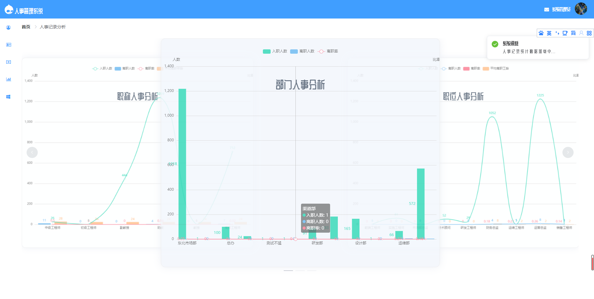 
## 系统管理
### 基础信息设置
系统管理主要对系统,管理员等一些操作,包括基础设置,系统管理,操作员管理,授权处理.基础信息设置主要对部门,职位,职称,奖惩规则和权限组的设置增删查改功能管理,实现部门树,权限树预览.职称等级设置.奖惩描述自定义及使用模糊提示等.
部门管理主要以多叉树的方式实现部门信息展示.及添加删除部门的操作.展示的实现由在Server端基于递归SQL的方式遍历部门树.删除操作当存在子部门.不能删除父部门.只能从叶子部门进行删除操作.添加不受限制.
员工职位管理即对企业职位的管理.由职位展示查询及自定义职位添加删除更改职位状态构成.员工奖惩管理主要用于自定义员工奖惩.由添加奖惩类型.分值.描述及删除修改编辑构成.自定义奖惩描述可以使用以有描述.也可以自己定义.员工职称管理于职位管理类似.由职称展示查询及自定义职称添加删除,更改职称状态构成.不同在于职称有对应等级.添加时需要选择职称等级.
用户权限管理由权限树预览.角色添加.角色权限设置构成.权限树在数据处理上以二叉树的结构展示.因为只有两级菜单.对于不同角色通过权限树的设置.赋予不同菜单权限.权限树预览是基于VeCharts树形图表的展示.在UI设计上.以折叠面板和Tree树型组件方式实现.
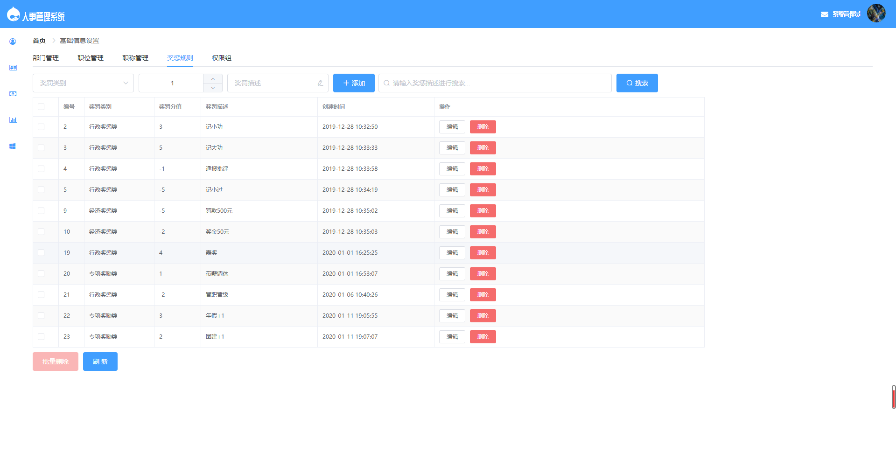
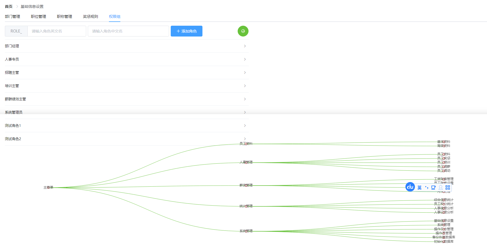

### 系统管理
系统管理主要由公告管理和公告编辑构成.公告编辑主要结合VueQuillEditor富文本第三方扩展实现,有标题和具体公告内容构成.公告管理包括公告修改,公告预览,公告删除.可以动态修改所有公告信息并实现预览.
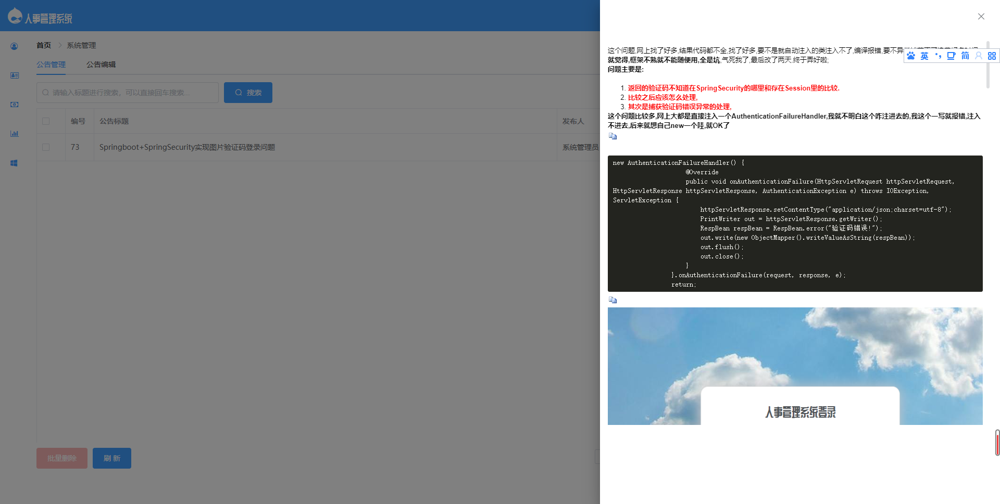
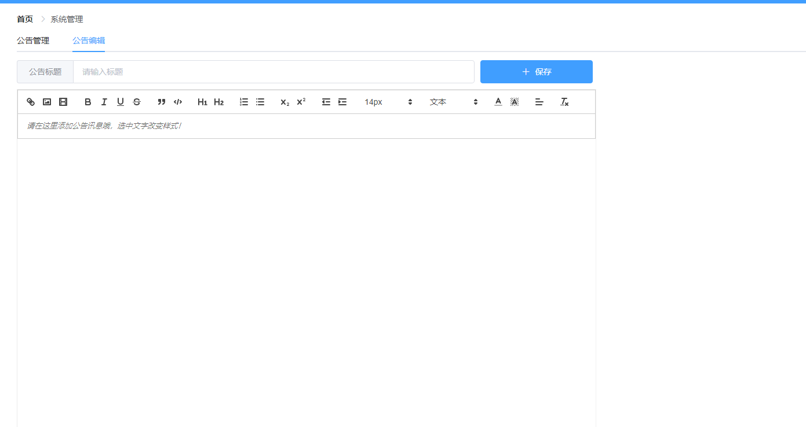
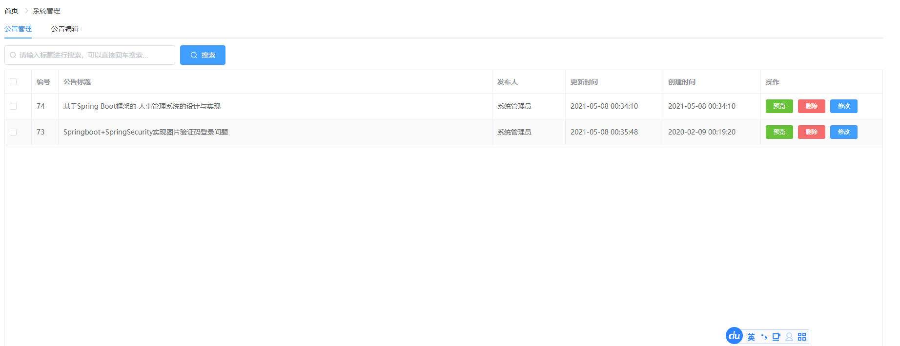
###操作日志管理
操作日志管理主要展示登录用户对系统的操作信息.记录具体人事操作,便于以后的信息检索,功能上实现由日志类型,日期间隔的日志查询.
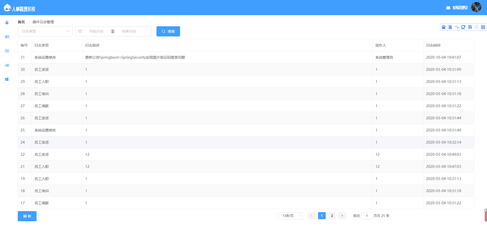 
### 操作员管理
操作员管理在UI设计上使用卡片组件,弹性布局处理.功能包括基本信息展示,刪改功能.具体由管理员角色权限的设置,是否启用的修改,删除管理员操作构成,在权限修改上以相互赋予的方式实现,即登录用户不能自己给自己赋值.只能通过其他用户赋予权限.
### 操作员管理

## 参考文献
+ [1]程桂花.MVVM前后端数据交互中安全机制的研究与实现[D].浙江理工大学硕士学位设计,2017:6-7 
+ [2]李宇,刘彬.前后端分离框架在软件设计的应用[J].无线互联科技,2018(17):41-42 <p>
+ [3]张可人.基于 RBAC 的权限管理控制系统的设计与实现[D].西安电子科技大学硕士学位设计,2014:4-5 <p>
+ [4][美]Craig Walls 著,丁雪丰 译.Spring Boot实战[M].北京:人民邮电大学出版社,2016:15-16
+ [5]赛序朋,侯瑞春,丁香乾. Spring Security的Web资源保护功能研究与扩展[J].微型机与应用,2015,34(15):5-7
+ [6]尤雨溪.vue.js官网[db/ol].https://cn.vuejs.org/v2/guide/,2019-12 - 14/2020-4-20
+ [7]麻省理工学院.axios[db/ol].https://github.com/axios/axios,2019-1- 22/2020-4-20
+ [8]梁灏.Vue.js实战[M].北京:清华大学出版社,2017:218-219
+ [9]赵耕野.对B/S和C/S架构的特点及比较分析[J].中国科技财富,2010(2):89-90
+ [10][日]上野宣 著,于均良 译.图解HTTP[M].北京:人民邮电出版社,2014:186-187
